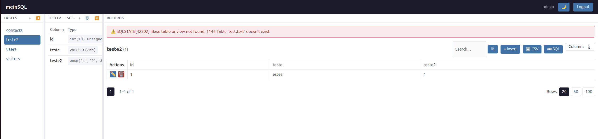
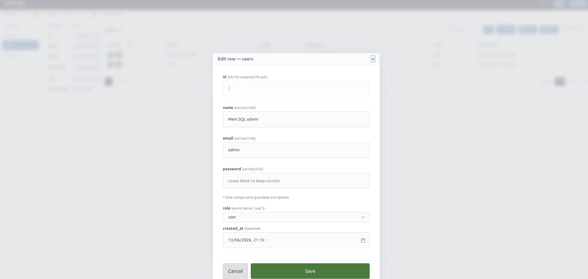
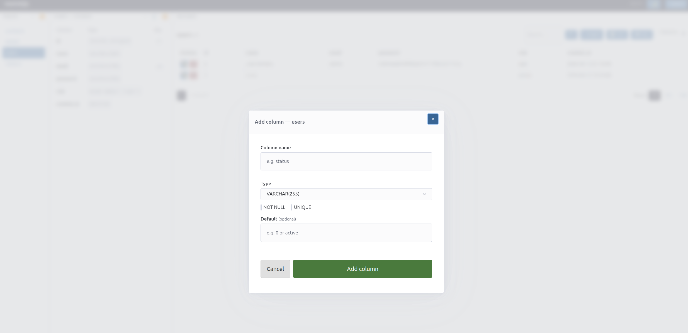

# meinSQL

A minimal, single-file PHP MySQL admin panel. Drop it anywhere and it works.

> A lightweight alternative to phpMyAdmin and Adminer — no Composer, no dependencies, no framework. Just one PHP file.



---

## Features

- **Single file** — everything in `index.php` (~68KB)
- **Zero dependencies** — no Composer, no npm, no framework
- **Session login** with brute-force IP rate limiting (5 attempts / 10 min)
- **3-pane layout** — tables list / schema / records, all resizable and collapsible
- **Browse & search** — paginated records (20/50/100), sort by column, full-text search across text columns
- **CRUD** — insert, edit, delete rows with smart field types (date picker, enum select, password hash)
- **Schema tools** — view columns/types, add column (INT, DOUBLE, VARCHAR, TEXT, DATE, ENUM), create table, drop table
- **Export CSV** — per-table export
- **Export SQL dump** — full database or single table (DROP + CREATE + INSERTs), ready to restore
- **Import SQL** — upload a `.sql` file and execute it statement by statement, with error reporting
- **SQL query box** — run any query, SELECT results shown inline
- **CSRF protection** on all forms
- **Delete rate limiting** (50 rows/hour)
- **`ALLOW_DROP_TABLE` setting** — disable DROP TABLE globally, including inside imported SQL files
- **Dark/light mode** toggle
- **Auto-init** — if the DB is empty and `init.sql` exists, it runs automatically



---

## Setup

### 1. Requirements

- PHP 8.1+ with `php-mysql` (or `php-pdo_mysql`)
- MySQL or MariaDB

### 2. Install

```bash
git clone https://github.com/joelviseu/meinsql.git
cd meinsql
```

Or just download `index.php` directly.

### 3. Configure

Edit the constants at the top of `index.php`:

```php
define('DB_HOST',    '127.0.0.1');
define('DB_PORT',    3306);
define('DB_NAME',    'mydb');
define('DB_USER',    'myuser');
define('DB_PASS',    'mypassword');

define('ADMIN_USER', 'admin');
define('ADMIN_PASS', 'admin123');

define('ALLOW_DROP_TABLE', true);  // set to false to disable DROP TABLE everywhere
```

### 4. Run

```bash
php -S localhost:8080
```

Open `http://localhost:8080` and log in.

### MySQL user (minimum permissions)

```sql
CREATE USER 'meinsql'@'localhost' IDENTIFIED BY 'strongpassword';
GRANT SELECT, INSERT, UPDATE, DELETE, CREATE, DROP, ALTER ON mydb.* TO 'meinsql'@'localhost';
FLUSH PRIVILEGES;
```

---

## Optional: init.sql

If the database is empty on first load, meinSQL will automatically execute `init.sql` if it exists in the same directory. Use it to seed your schema and demo data. The included `init.sql` creates `users`, `visitors`, and `contacts` tables with sample rows.



---

## Security notes

- Credentials are stored as PHP constants 
- All queries use PDO prepared statements (no SQL injection)
- CSRF tokens on every form
- Login brute-force protection: 5 failed attempts locks the IP for 10 minutes
- Delete rate limit: max 50 row deletions per hour per session
- Table/column names are validated against a whitelist before use

---

## What it doesn't do

- No multi-database support
- No index or foreign key management
- No user management (MySQL users)
- No stored procedures or views

If you need those, use [Adminer](https://www.adminer.org/) (~500KB) or [phpMyAdmin](https://www.phpmyadmin.net/).

---

## License

MIT — do whatever you want with it.
